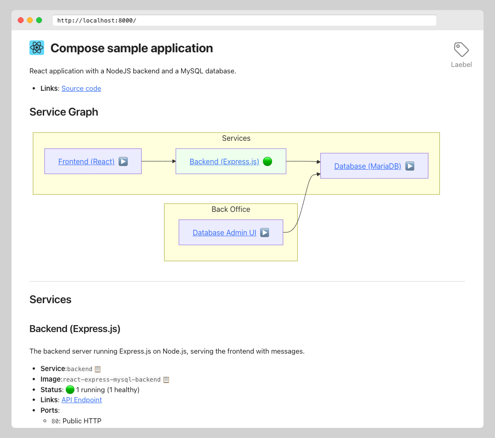

# Laebel

_Automatic README-style documentation site for your Docker Compose project._

Laebel is a small server that runs in your Docker Compose project, serving a website that documents your project.

<figure>
<a href="./examples/react-express-mysql/README.md"></a>
<figcaption><em>An example of a documentation site generated by Laebel. <a href="./examples/react-express-mysql/README.md">View the full example</a>.</em></figcaption>
</figure>
<p></p>

Laebel uses the Docker API to get information about the services in your project,
and then displays that information in an easy-to-read format.
It even includes a graph of how the services are connected.
Additional information about the services can be added using labels in the Docker Compose project.

The goal is to make it feel like someone wrote a nice README for your project, but without the manual work. 😀

## Features

- **Displays a service graph**: An easy-to-understand, visual representation of how the services in your project are connected. 
  It is based on [`depends_on`](https://docs.docker.com/reference/compose-file/services/#depends_on) relations in your Docker Compose project.
- **Describes each service in your project**: Lists all services and the important information about them.
  The information includes service name, image name, how many containers are running, and the status of the containers.
- **Additional user-configurable metadata**: Allows you to describe your services in more detail, 
  using [`labels`](https://docs.docker.com/reference/compose-file/services/#labels) in your Docker Compose project.
  It allows you to specify title, description, group, external links, and more.
  The metadata is based on the [OpenContainers Annotations Spec](https://specs.opencontainers.org/image-spec/annotations/) 
  but is extended through a set of Laebel-specific labels. 

## Usage

### As a service in a Docker Compose project

To get started, add the following service to your Docker Compose project:

```yaml
laebel:
    image: ghcr.io/henrikje/laebel:latest
    # Expose port 8080 to access the Laebel website (or change to another port if you prefer).
    ports:
    - "8080:8080"
    # Mount the Docker socket in read-only mode.
    # This allows Laebel to read information about the services in your project.
    volumes:
    - "/var/run/docker.sock:/var/run/docker.sock:ro"
```

Then run `docker compose up` and open your browser at http://localhost:8080/ (or the host and port you use).

For a full example, see the [React-Express-MySQL example](./examples/react-express-mysql/README.md).

### As a stand-alone container

If you do not want to add Laebel to your Compose Project, you can run Laebel as a stand-alone container.
Then you need to tell Laebel which Compose Project to document using the environment variable `COMPOSE_PROJECT_NAME`.

```bash
docker run \
  -e COMPOSE_PROJECT_NAME=<your-project> \
  -v "/var/run/docker.sock:/var/run/docker.sock:ro" \
  -p 8080:8080 \
  ghcr.io/henrikje/laebel:latest
```

Note that in this case, you cannot put project metadata environment variables in the Compose Project.
You will have to manage those environment variables yourself.

## Configuration

Laebel will work out of the box and provide useful information about your project.
However, it really shines when you add additional metadata about your Docker Compose project.

The most straight-forward way to add documentation is to add labels in your primary `compose.yaml` file.
If you want to keep the labels separate from the main configuration, you can use a `compose.override.yaml` file.
Docker Compose will automatically [merge](https://docs.docker.com/compose/how-tos/multiple-compose-files/merge/) the two files
when you run `docker compose`.

### Service metadata through labels

Laebel reads metadata about each service from labels in the Docker Compose project.
This is used to describe the services in more detail than just the image name and status.

The following [OpenContainers Annotations Spec](https://specs.opencontainers.org/image-spec/annotations/) labels are supported:

- `org.opencontainers.image.title`: A human-readable title of the service.
- `org.opencontainers.image.description`: A description of the service.
- `org.opencontainers.image.url`: A URL to the service's homepage.
- `org.opencontainers.image.documentation`: A URL to the documentation of the service.
- `org.opencontainers.image.source`: A URL to the source code of the service.

In addition, Laebel supports the following custom labels:

- `net.henko.laebel.group`: A group name to categorize services.
  Services with the same group name will be displayed together, both in the service graph and in the list.
- Any number of external links, specified by a pairs of labels:
  - `net.henko.laebel.link.<key>.url`: The URL of the link.
  - `net.henko.laebel.link.<key>.label`: The title of the link.
    
  The key can be any string, but it should be unique for each link, and must be the same for both labels of a pair. 

### Project metadata through environment variables

Laebel also supports setting metadata for the project as a whole.
Since these values are not associated with any particular service, 
they are specified by adding _environment variables_ to the `laebel` service in the Docker Compose project.

- `LAEBEL_PROJECT_TITLE`: A human-readable title of the project.
- `LAEBEL_PROJECT_DESCRIPTION`: A description of the project.
- `LAEBEL_PROJECT_URL`: A URL to the project's homepage.
- `LAEBEL_PROJECT_DOCUMENTATION`: A URL to the documentation of the project.
- `LAEBEL_PROJECT_SOURCE`: A URL to the source code of the project.
- `LAEBEL_PROJECT_ICON`: A URL to an image file to use as the logo of the project.
  Can be a `data:` URL to avoid external dependencies.

## Feedback

If you have any thoughts or questions, please [reach out to me](https://henko.net/contact/).

_Sidenote_: Why the name _Laebel_? 
It is a reference to the idea that to label something is to explain what it is,
combined with the fact that Laebel relies on Docker _labels_ to get information about the project and its services.
However, I also wanted to be a cool kid like Traefik and Jaeger. 😉

## License

This project is licensed under the terms of the [MIT license](LICENSE.md).
