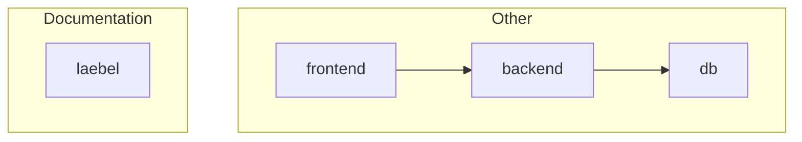

# TODO

## Version 0.1.1

- [x] Make Laebel output the full URL to the service, not just the port.
- [ ] Replace default name "Other" with "Services" in the graph.
- [ ] Try `graph TD` and `direction LR` inside subgraphs.
- [ ] Document idea to use `compose.override.yaml` for documentation.
- [ ] Optimize Dockerfile for caching.
- [ ] Set up an example Docker Compose project to demonstrate the tool.
  - This can be used in examples and for manual testing.
  - Or can I use an existing public Compose project?
    - https://github.com/docker/awesome-compose/blob/master/elasticsearch-logstash-kibana/compose.yaml
    - https://github.com/docker/awesome-compose

## Future

- [ ] Add support for Markdown.
- [ ] Live-reload the page when the Docker Compose cluster changes; perhaps use HTMX?
- [ ] Add a sort order label to the services, so they can be displayed in a specific order. Otherwise sort alphanumerically. Perhaps also a sort order for groups?
- [ ] Add status icons for each service, both in the graph and in the list:
  🟢=healthy, ▶️=running, ⏸️=paused, ⏹️=stopped/exited, 🚫=unhealthy, 🔄=restarting, *️⃣=mixed
- [ ] Add a favicon to the project.
- [ ] Add a `net.henko.laebel.hidden` label to hide certain services.
- [ ] Write unit tests for the project.

