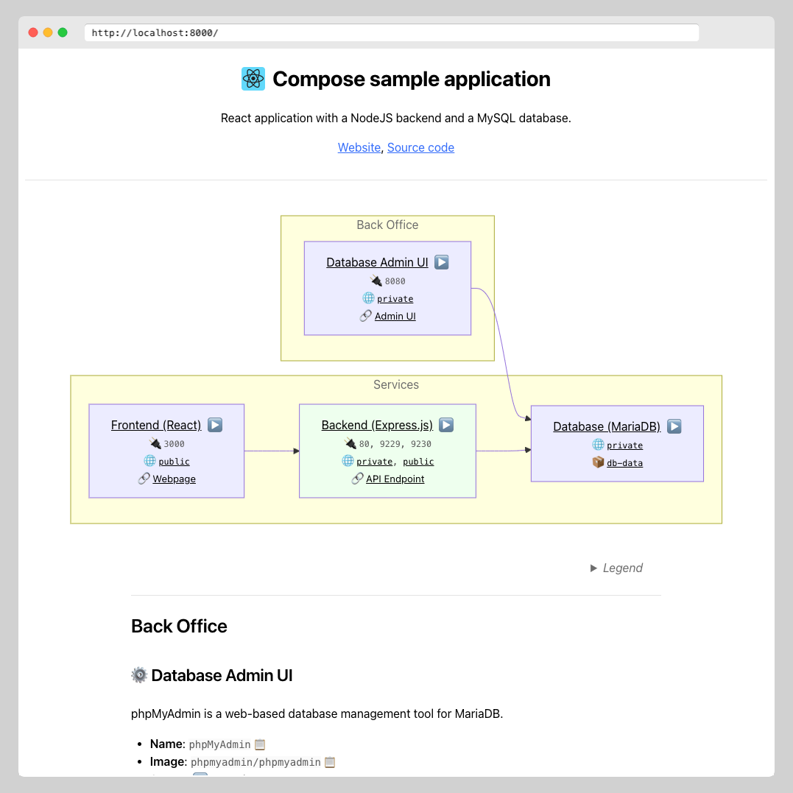

# Example: Compose sample application

The example is borrowed from Docker's [Awesome Compose](https://github.com/docker/awesome-compose) repository.

It is a React application with a NodeJS backend and a MySQL database.

## The configuration

To clearly show what is part of the original example and what is added for Laebel, I've separated the two parts.
- [`compose.yaml`](./compose.yaml): The original Compose file from the example. It defines the services and their configuration.
- [`compose.override.yaml`](./compose.override.yaml): The Laebel configuration file. It extends the original Compose file with Laebel-specific configuration.

## The output

[View the full documentation site](https://rawcdn.githack.com/henrikje/laebel/v0.4.0/examples/react-express-mysql/laebel-output.html) generated by Laebel for this example.

